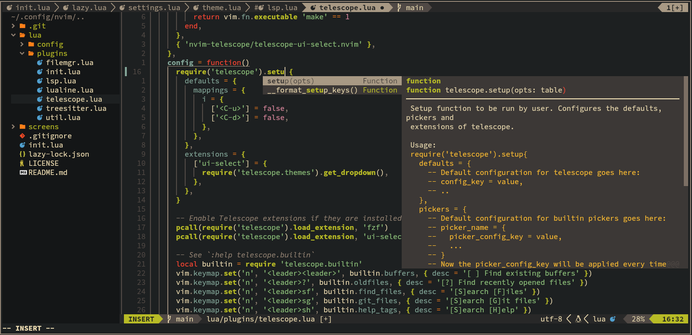

# NeoVim config

Clone into `.config/nvim` and start NeoVim.
Dependencies:
 - fzf
 - fd
 - luarocks
 - lazygit

Features:
 - lazy for plugin management
 - telescope for search and navigation
 - file tree-view and file manager integrated
 - lsp with autocomplete
 - language server management integration using mason
 - treesitter for code analysis and coloring
 - lualine for bottom status line
 - using gruvbox-material theme for all

## Customization
 - configure LSP servers at the top of [lua/plugins/lsp.lua](lua/plugins/lsp.lua)
 - configure theme settings in [lua/plugins/init.lua](lua/plugins/init.lua)
 - set lualine theme in [lua/plugins/lualine.lua](lua/plugins/lualine.lua)

## Keybinds and commands
Here is a list of some of the custom binds and commands.

## Commands

| Command  | Description                |
| -------- | -------------------------- |
| `:Lazy`  | Plugin management          |
| `:Mason` | Language server management |

### Text-objects
Using mini.ai for extended textobjects.
 - defines mappings for both `a` and `i` in `v` and `o` mode

Default textobject is activated for identifiers from digits (0, ..., 9), punctuation (like `_`, `*`, `,`, etc.), whitespace (space, tab, etc.)

| Key |      Name                   |
| --- | ---------------             |
|     | Default                     |
| `(` | Balanced ()                 |
| `[` | Balanced []                 |
| `{` | Balanced {}                 |
| `<` | Balanced <>                 |
| `)` | Balanced ()                 |
| `]` | Balanced []                 |
| `}` | Balanced {}                 |
| `>` | Balanced <>                 |
| `b` | Alias for ),],}             |
| `"` | Balanced "                  |
| `'` | Balanced '                  |
|  `  | Balanced `                  |
| `q` | Alias for ",',`             |
| `?` | User prompt (typed e and o) |
| `t` | Tag                         |
| `f` | Function call               |
| `a` | Argument                    |

### General

| Mode | Keys         | Description                                     |
| ---- | ------------ | ----------------------------------------------- |
| n    | `K`          | Move selected lines UP with auto-indent         |
| n    | `J`          | Move selected lines DOWN with auto-indent       |
| x    | `<Space>p`   | Paste-overwrite selected                        |
| n/v  | `<Space>y`   | Begin yank to system clipboard                  |
| n    | `<Space>Y`   | Yank line to system clipboard                   |
| n/v  | `<Space>d`   | Begin delete without clipboard                  |
| n    | `<Space>ss`  | Search and replace                              |
| n    | `<Ctrl-k>`   | Quickfix next                                   |
| n    | `<Ctrl-j>`   | Quickfix previous                               |
| n    | `<Space>k`   | Loclist next                                    |
| n    | `<Space>j`   | Loclist previous                                |
| n    | `<Space>bx`  | Delete current buffer and switch to next        |
| n    | `<Space>bX`  | Force delete current buffer and switch to next  |
| n    | `<Space>bd`  | Delete current buffer                           |
| n    | `<Space>bD`  | Force delete current buffer                     |
| n    | `<Space><CR>`| Alternate buffer (:e #)                         |
| n    | `<Space>zz`  | Zen-Mode                                        |
| n    | `<Space>?`   | Buffer Local Keymaps (which-key)                |

### Movement

| Mode  | Keys       | Description                        |
| ----- | ---------- | ---------------------------------- |
| n/x/o | `s`        | Flash - jump                       |
| n/x/o | `S`        | Flash - treesitter                 |
| o     | `r`        | Flash - remote (in o-pending mode) |
| o/x   | `R`        | Flash - treesitter search          |
| c     | `<Ctrl-s>` | Toggle Flash Search                |

### Telescope

| Mode | Keys             | Description                           |
| ---- | ---------------- | ------------------------------------- |
| n    | `<Space><Space>` | [ ] Find existing buffers             |
| n    | `<Space>sf`      | [S]earch [F]iles                      |
| n    | `<Space>sg`      | [S]earch [G]it files                  |
| n    | `<Space>sr`      | [S]earch by G[r]ep                    |
| n    | `<Space>s.`      | [?] Find recently opened files        |
| n    | `<Space>sw`      | [S]earch current [W]ord               |
| n    | `<Space>sd`      | [S]earch [D]iagnostics                |
| n    | `<Space>st`      | [S]earch [T]ODOs                      |
| n    | `<Space>sn`      | [S]earch [N]oice/[N]otifications      |
| n    | `<Space>sh`      | [S]earch [H]elp                       |
| n    | `<Space>sk`      | [S]earch [K]eymaps                    |
| n    | `<Space>su`      | [S]earch [U]ndo-tree                  |
| n    | `<Space>/`       | [/] Fuzzily search in current buffer] |

### LSP

| Command   | Description                    |
| --------- | ------------------------------ |
| `:Format` | Format current buffer with LSP |

| Mode | Keys        | Description                 |
| ---- | ----------- | --------------------------- |
| n    | `<Space>rn` | [R]e[n]ame                  |
| n    | `<Space>ca` | [C]ode [A]ction             |
| n    | `gd`        | [G]oto [D]efinition         |
| n    | `gr`        | [G]oto [R]eferences         |
| n    | `gI`        | [G]oto [I]mplementation     |
| n    | `<Space>D`  | Type [D]efinition           |
| n    | `<Space>ds` | [D]ocument [S]ymbols        |
| n    | `<Space>ws` | [W]orkspace [S]ymbols       |
| n    | `K`         | Hover Documentation         |
| n    | `<Ctrl-k>`  | Signature Documentation     |
| n    | `gD`        | [G]oto [D]eclaration        |
| n    | `<Space>wa` | [W]orkspace [A]dd Folder    |
| n    | `<Space>wr` | [W]orkspace [R]emove Folder |
| n    | `<Space>wl` | [W]orkspace [L]ist Folders  |

### Autocomplete

| Keys           | Description                |
| -------------- | -------------------------- |
| `<Ctrl-d>`     | Scroll docs -4             |
| `<Ctrl-f>`     | Scroll docs +4             |
| `<Ctrl-Space>` | Show autocomplete dialog   |
| `<Enter>`      | Confirm autocomplete       |
| `<Tab>`        | Next item / Snip next jump |
| `<Shift-Tab>`  | Prev item / Snip prev jump |

### Diagnostic

| Mode | Keys       | Description              |
| ---- | ---------- | ------------------------ |
| n    | `<Space>q` | Open diagnostic details  |
| n    | `<Space>e` | Open diagnostics loclist |
| n    | `[d`       | Diagnostic goto prev     |
| n    | `]d`       | Diagnostic goto next     |

### File management

| Mode | Keys        | Description                |
| ---- | ----------- | -------------------------- |
| n    | `<Space>tt` | [T]ree [t]oggle            |
| n    | `<Space>to` | [T]ree [o]pen and focus    |
| n    | `<Space>tc` | [T]ree [c]lose             |
| n    | `<Space>f`  | mini.files - file dir      |
| n    | `<Space>F`  | mini.files - project dir   |
| n    | `<Space>-`  | oil.nvim file mgr          |
| n    | `-`         | oil.nvim file mgr floating |
| n    | `q`         | oil.nvim file mgr close    |
| n    | `<Space>lg` | open lazygit floating      |

### Markdown

| Mode | Keys | Description               |
| ---- | ---- | ------------------------- |
| n    | `mt` | (M)arkdown preview toggle |
| n    | `ms` | (M)arkdown split toggle   |
